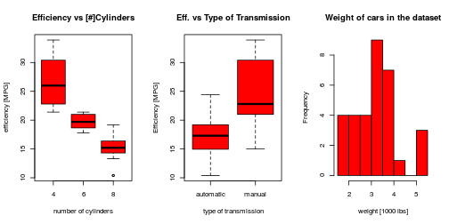
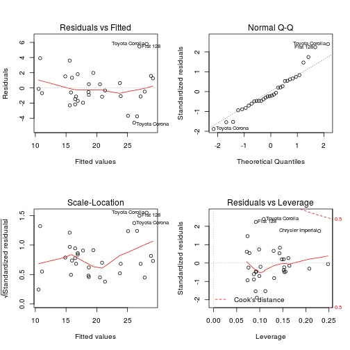
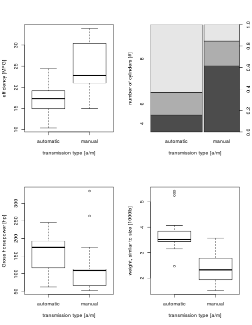

Executive summary
=================

This work focuses on determining whether the type of transmission of a car, automatic or manual, does affect its efficiency, which is measured in miles per galon (mpg). This study uses statistical methods on data acquired from real cars. The data used in the analysis  was extracted from the 1974 Motor Trend US magazine, and corresponds to 32 automobiles (1973–74 models) and 10 variables of interest. 

Our analysis leads to two main conclusions: 

 - The first is that this data does not show a statistically significant contribution of the type of transmission to the vehicle's efficiency, with $p_{value} = 0.9089474$. 
 
 - The second is that in order to answer the motivating question of this study and ascertain which type of transmission is more efficient, it is required to gather more data. Our currently available data suffers from a fundamental flaw: most of the recorded automatic cars are of big size and horse power, while most of the recored manual cars are of small size and horse power. 
   
Thus, this study requires to be replicated on a new dataset with information on automatic and manual transmission cars of similar size and horse power, which should have data on all the range of engine powers.

# Technical analysis

The focus of this study is to understand the relationship between various characteristics of a car with regards to its efficiency. Thus, the utilized statistical methods obtain simple but highly interpretable models, namely: box-plots to analyse our data distribution, linear regression to obtain interpretable models and analysis of variance tables (Anova tables) to compare between models.

***Processing raw data:*** This part of the code loads the dataset and converts category type variables into R variables of type factor.


```r
rm(list = ls())
library(datasets)
data(mtcars)

mtcars$cyl <- as.factor(mtcars$cyl)
mtcars$am[mtcars$am == 0] <- "automatic"
mtcars$am[mtcars$am == 1] <- "manual"
mtcars$am <- factor(mtcars$am, levels = c("automatic", "manual"))
mtcars$gear <- as.factor(mtcars$gear)
mtcars$carb <- as.factor(mtcars$carb)
```


***Exploratory data analysis:*** Setting aside technical differences in each car's engine, such as the type of transmission, the efficiency is most probably related to the car's engine power and the car's size (weight and aerodynamic profile). As shown in the Figure 1 of the Appendix, the efficiency seems to be related the number of cylinders of the car and the type of the transmission. The weight of the cars in the data set ranges from 1500lb to 5500lb as shown in the thirds plot of this figure. 

***Inference and model selection:*** first a model that uses engine power and the car's size as predictors is obtained. Then, it is shown that the model $mpg = f(cyl,wt)$ is the biggest one that can be obtained from the data. The number of cylinders is prefered to engine horse power because it increases model interpretability. The size of the car is obtained from its weight. Note that the ***uncertainty in the inference results*** is quantified by the $p_{value}$ of each model's statistcal significance with regards to the selected BASE model.


```r
fit1 <- lm(mpg ~ factor(cyl), data = mtcars)  # related to engine power
summary(fit1)  # p-value: 4.979e-09 *** , ACCEPT model
fit2 <- update(fit1, mpg ~ factor(cyl) + wt, data = mtcars)  # related to power and size
summary(fit2)
anova(fit1, fit2)  # p-value: 0.0002769 *** , ACCEPT model, BASE model for analysis
fit3 <- update(fit2, mpg ~ factor(cyl) + wt + disp, data = mtcars)
fit4 <- update(fit2, mpg ~ factor(cyl) + wt + hp, data = mtcars)
fit5 <- update(fit2, mpg ~ factor(cyl) + wt + drat, data = mtcars)
anova(fit1, fit2, fit3)  # p-value: 0.8997211     , REJECT disp  from model
anova(fit1, fit2, fit4)  # p-value: 0.0636127 .   , REJECT hp    from model
anova(fit1, fit2, fit5)  # p-value: 0.9182904     , REJECT model from model
fit6 <- update(fit2, mpg ~ factor(cyl) + wt + qsec, data = mtcars)
anova(fit1, fit2, fit6)  # p-value: 0.201042      , REJECT qsec  from model
fit7 <- update(fit2, mpg ~ factor(cyl) + wt + vs, data = mtcars)
anova(fit1, fit2, fit7)  # p-value: 0.6046745     , REJECT vs    from model
fit8 <- update(fit2, mpg ~ factor(cyl) + wt + am, data = mtcars)
anova(fit1, fit2, fit8)  # p-value: 0.908947 <<< REJECT transmission type from model >>>
fit9 <- update(fit2, mpg ~ factor(cyl) + wt + gear, data = mtcars)
fit10 <- update(fit2, mpg ~ factor(cyl) + wt + carb, data = mtcars)
anova(fit1, fit2, fit9)  # p-value: 0.5849930    , REJECT gear   from model
anova(fit1, fit2, fit10)  # p-value: 0.2412195    , REJECT carb   from model
```


***Residual plot diagnostics:*** See Fig. 2 of the Appendix for diagnostics of the BASE model $mpg = f(cyl,wt)$.

***Additional exploratory data analysis:*** as shown in Fig. 3 of the Appendix, our currently available data suffers from a fundamental flaw. Most of the recorded automatic cars are of big size and horse power, while most of the recored manual cars are of small size and horse power. This fact strongly affects the results of the analysis, because the variablity of the data is fully explained by a relatively simple model, $mpg = f(cyl,wt)$. There is not enough variability in the data to determine which additional predictor variable is required to fully explain which characteristics of a car determine its efficiency. Thus, this study requires to be replicated on a new dataset with information on automatic and manual transmission cars of similar size and horse power, which should have data on all the range of engine powers.

***Reproducible code:*** [https://github.com/manishrocksag/RegressionModels](https://github.com/jespestana/DS_Specialization_C07_CP1https://github.com/jespestana/DS_Specialization_C07_CP1)

# Conclusions

***Answers to the questions of interest (Inference conclusions):***Based on these data there is not a statistically significant contribution of the type of transmission to the vehicle's efficiency, the addition of this variable to the model is rejected with $p_{value} = 0.9089474$. Thus, based on this study ***there is no influence of the type of transmission in the vehicle's efficiency***.

***However,*** as shown in Figure 3 of the Appendix: our ***current  data suffers from a fundamental flaw***. Most of the recorded automatic cars are of big size and horse power, while most of the recored manual cars are of small size and horse power. Thus, ***this study requires to be replicated*** on a new dataset with information on automatic and manual transmission cars of similar size and horse power, which should have data on all the range of engine powers.

# Appendix

 Figure 1, Exploratory data analysis: efficiency versus some characteristics  of the cars and weight distribution of cars in the dataset. The middle   box-plot shows that there may be a strong relation between car   transmission type and its efficiency.


 Figure 2, Residual plot diagnostics of the BASE mode used during the analisys, $mpg = f(cyl,wt)$. The variability of the residual shows homocedasticity as shown by both plots in the left, the variance is constant and does not show any special tendency. The Cook's distance of the residuals shows that no point has a big leverage on the fit. And the normality of the data is acceptable, though the Normal Q-Q plot shows some lack of normality for extreme data points.


 Figure 3, Additional exploratory analysis: our currently available data suffers from a fundamental flaw: most of the recorded automatic cars are of big size and horse power, while most of the recored manual cars are of small size and horse power.


